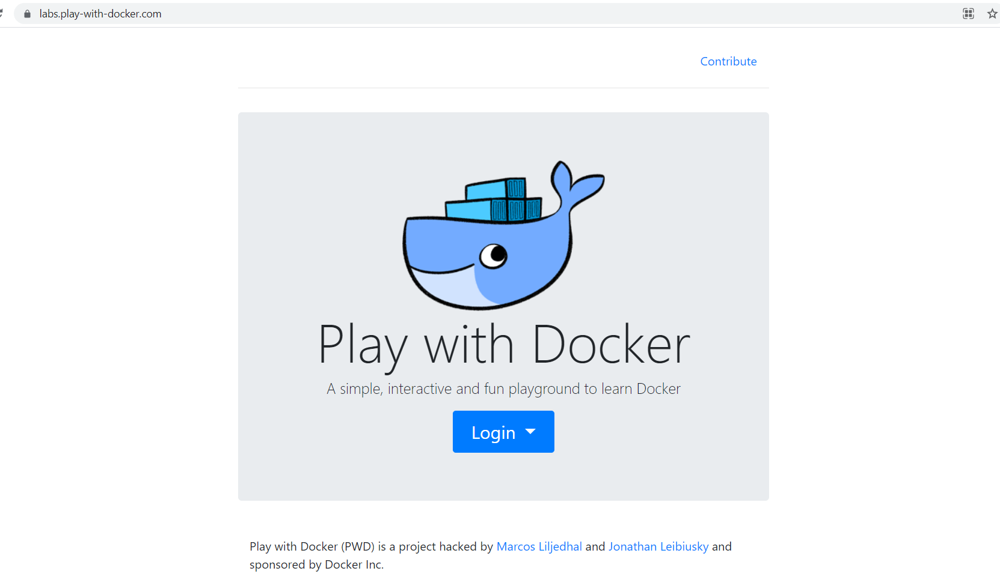
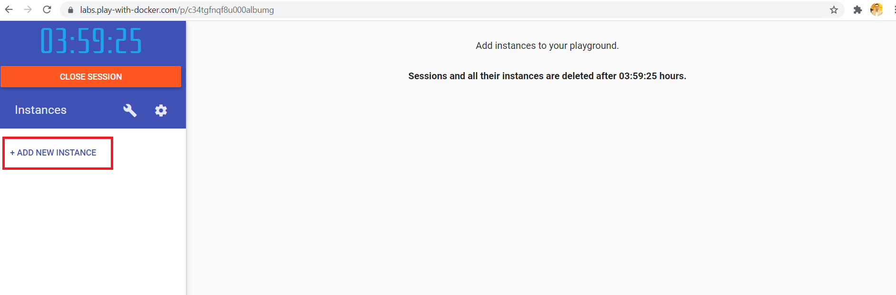
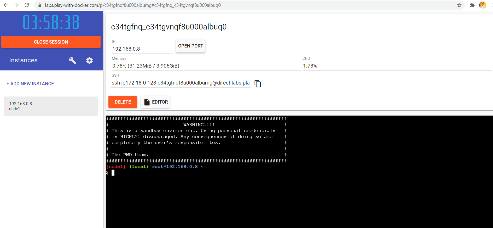
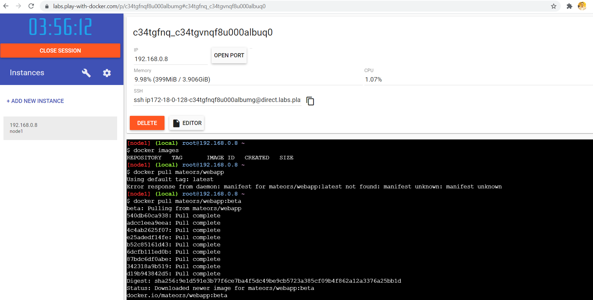
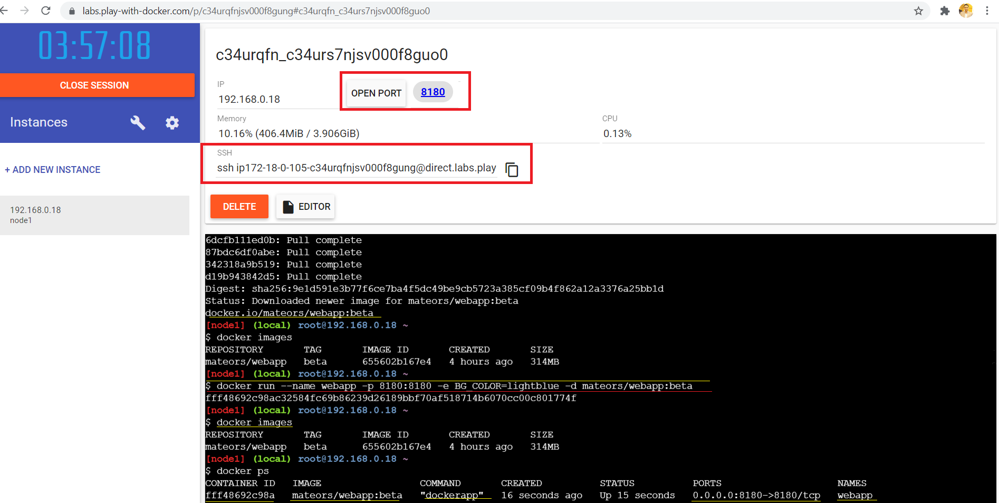
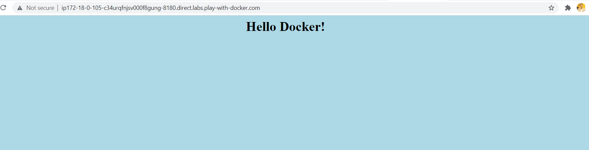

# Docker Labs | Docker playground
>[Docker Lab](https://labs.play-with-docker.com)

> Play with Docker (PWD)
> PWD is a Docker playground which allows users to run Docker commands in a matter of seconds. It gives the experience of having a free Alpine Linux Virtual Machine in browser, where you can build and run Docker containers and even create clusters in Docker Swarm Mode.

> Docker Lab **Web Interface**\

> Docker Lab Dashboard (After login)\

> Playground\

> Pull mateors/webapp:beta image from docker hub (`docker pull mateors/docker:beta`)\

> Pull the docker image from the docker hub\
> `docker pull mateors/webapp:beta`\

> After pulling create the container using docker run command\
> `docker run --name webapp -e BG_COLOR=lightblue -d mateors/webapp:beta`\

> Navigate to the home page clicking on **port 8180**\
>

Reference:
* https://labs.play-with-docker.com/
* [IP Detect](https://major.io/icanhazip-com-faq/)