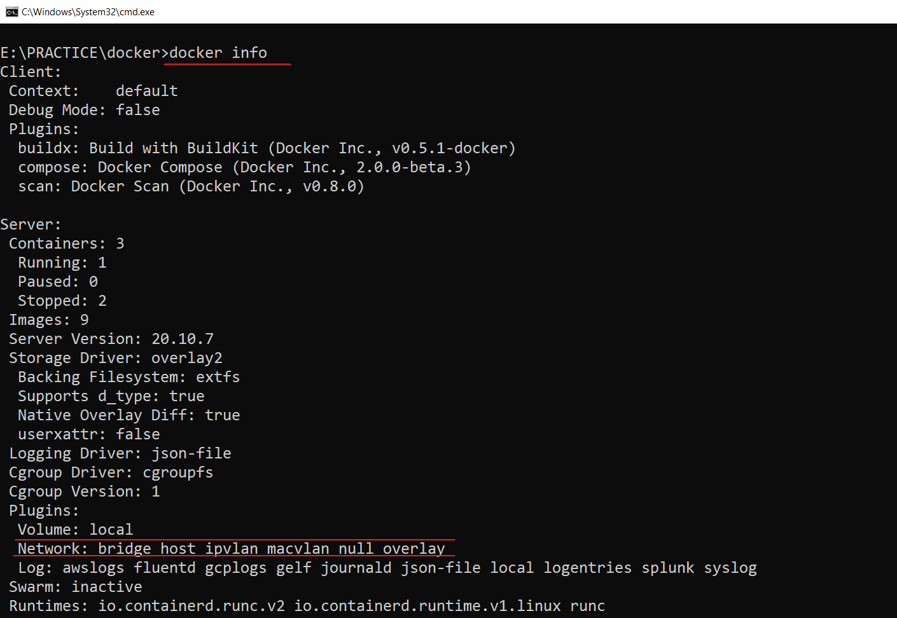
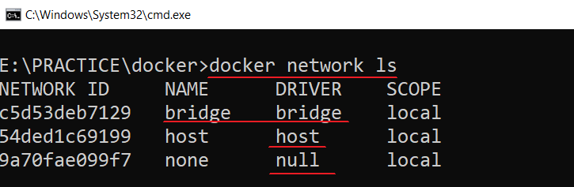
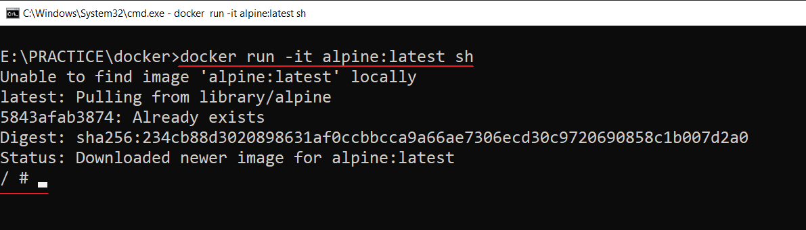

# Docker Networking
> Docker networking allows you to attach a container to as many networks as you like. You can also attach an already running container.

> `docker exec -it -u root <containerid> sh`\
> `ping webapp`\

> `docker info`\

> `docker network ls`\

> `docker run -it alpine:latest sh`\

> `docker run -d --network host --name mynginx nginx:latest` (Not working in windows)\
> `docker stop mynginx`