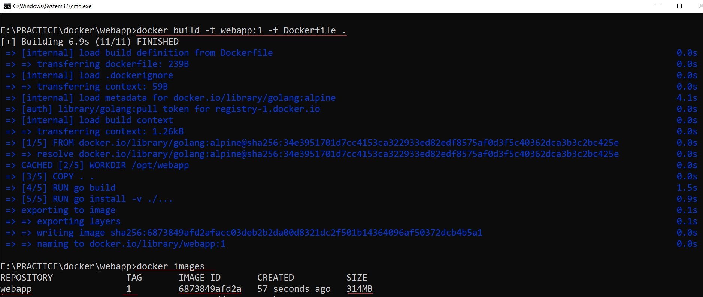
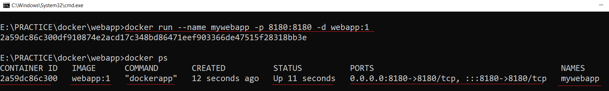
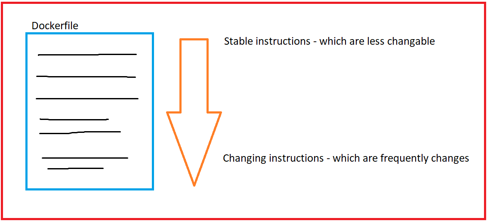

# Docker command practice

## Creating my first webapp using Dockerfile
> At first building image using docker build command\
> `docker build -t webapp:1 -f Dockerfile .`\

## Run my first container using my image webapp:1
> `docker run --name mywebapp -p 8180:8180 -d webapp:1`\
\

## Run container from docker hub
> `docker run --name mywebapp -p 8181:8180 -e BG_COLOR=gray -d mateors/webapp:beta`

## Open your browser and head over to http://localhost:8180
> `http://localhost:8180`\

## Dockerfile good practices
> to optimise dockerfile\
